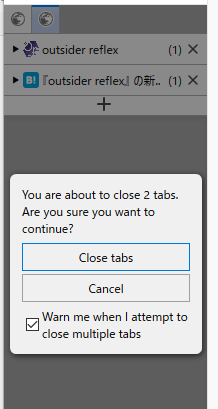

# webextensions-lib-rich-confirm


Helps to provide confirmation dialog with checkbox.

## Screenshots



## Required permissions

 * `tabs` or `activeTab`, if you want to use `RichConfirm.showInTab()`.

## Basic usage

Load the file `RichConfirm.js` from any document (background page, sidebar panel, or browser action panel), like:

```html
<script type="application/javascript" src="./RichConfirm.js"></script>
```

If you put `RichConfirm.js`, `RichConfirmDialog.html`, and `RichConfirmDialog.js` in different directories, you need to explicitly initialize it with the path to `RichConfirmDialog.html` before showing the dialog:

```javascript
RichConfirm.init('/path/to/RichConfirmDialog.html');
```

And, call `RichConfirm.show()` with required parameters like:

```javascript
var result = await RichConfirm.show({
  message:      'Are you ready?',
  buttons:      ['Yes', 'No'],
  checkMessage: 'Never show',
  checked:      false
});
```

Here is the list of parameters:

 * `message` (optional): A message for the confirmation dialog. This parameter is exclusive with `content`. (`String`)
 * `buttons` (required): Labels for buttons. (`Array` of `String`s)
 * `checkMessage` (optional): A label for the checkbox. (`String`)
 * `checked` (optional): Default state of the checkbox. (`Boolean`)

And there are more advanced parameters. See also the "Advanced usage" section.

 * `content` (optional): A source of HTML fragment to show as the content of the confirmation dialog. This parameter is exclusive with `message`. (`String`)

`RichConfirm.show()` returns a `Promise`. It will be resolved with an object with following attributes:

 * `buttonIndex`: The index of the button which is clicked. `-1` if the confirmation dialog is dismissed.
 * `checked`: The state of the checkbox.
 * `values`: The hash of values collected from input fields generated from the `content` parameter.

## Advanced usage

You can show a dialog with your favorite UI elements. To customize the dialog's behavior, create a class extending `RichConfirmDialog` and use it as your dialog script.
If you need to customize the dialog appearance and structure, you can also override `generateStyleDefinitions()` (for custom styling) and `updateContent()` (for content initialization).

In your custom dialog script (e.g. `CustomConfirmDialog.js`):

```javascript
import RichConfirmDialog from './RichConfirmDialog.js';

export default class CustomConfirmDialog extends RichConfirmDialog {
  generateStyleDefinitions() {
    // Override this to provide custom CSS for your custom elements.
    return super.generateStyleDefinitions() + `
      .${this.commonClass} .my-custom-element {
        color: red;
      }
    `;
  }

  async updateContent({ content, message }) {
    // Override this method to initialize your custom content structure.
    await super.updateContent({ content, message });
    // Or you can ignore super.updateContent() completely and build your own UI.
  }

  async onShown(container) {
    // This method receives the container element of the dialog contents.
    // You can register listeners to generated fields or do more initialization.
    // e.g.: container.querySelector('input[name="title"]').addEventListener(...);
  }

  async hide() {
    // You can destroy generated fields or do cleanup when the dialog is closed.
    // e.g.: this.content.querySelector('input[name="title"]').removeEventListener(...);
    return super.hide();
  }
}
window.CustomConfirmDialog = CustomConfirmDialog;
window.RICH_CONFIRM_DIALOG_CLASS_NAME = 'CustomConfirmDialog'; // this is required for showInPopup()
```

To use this custom dialog, you also need to create a custom HTML file (e.g., `CustomConfirmDialog.html`) that loads your custom script instead of `RichConfirmDialog.js`.
Then, extend the `RichConfirm` class itself to use the new HTML file without affecting the default `RichConfirm` configuration:

```javascript
import RichConfirm from './RichConfirm.js';

export default class CustomConfirm extends RichConfirm {
}
// Initialize with your custom HTML file
CustomConfirm.init('/path/to/CustomConfirmDialog.html');

// Now you can open your custom dialog by calling show() on your extended class:
var title  = 'example';
var url    = 'http://example.com/';
var result = await CustomConfirm.show({
  content: `
    <p><label>Name:
              <input type="text"
                     name="title"
                     value=${JSON.stringify(title)}></label></p>
    <p><label>Location:
              <input type="text"
                     name="url"
                     value=${JSON.stringify(url)}></label></p>
  `,
  buttons: ['Save', 'Cancel']
});

// The result object has a hash "values" with properties
// same to "name" or "id" of generated fields.
console.log(result.values.title);
console.log(result.values.url);
```

## Confirmation in the content area

If you want to show the confirmation dialog in the content area, call `RichConfirm.showInTab()` with an ID of a tab, like:

```javascript
var result = await RichConfirm.showInTab(10, {
  message:      'Are you ready?',
  buttons:      ['Yes', 'No'],
  checkMessage: 'Never show',
  checked:      false
});
```

The first parameter is `tabs.Tab.id`, the second parameter is same to `RichConfirm.show()`. If you omit the first argument, the dialog will appear in the current tab.


## Confirmation in a popup window

If you want to show the confirmation dialog as a popup window, call `RichConfirm.showInPopup()` with an ID of an owner window, like:

```javascript
var result = await RichConfirm.showInPopup(10, {
  modal:        true, // optional (default=false)
  title:        'Are you ready?', // optional (default="")
  message:      'Are you ready?',
  buttons:      ['Yes', 'No'],
  checkMessage: 'Never show',
  checked:      false
});
```

The first parameter is `windows.Window.id`, the second parameter is same to `RichConfirm.show()`. If you omit the first argument, the dialog will be placed on the last focused window.

If your extension has `<all_urls>` permission, the dialog window/tab is initially opened with `about:blank` and its contents are injected into it. This prevents the dialog from being restored unexpectedly by the browser's "Restore closed tabs/windows" feature (like Ctrl-Shift-T on Firefox 116 and later).

When using `RichConfirm.showInPopup()`, the dialog class methods like `onShown()` and `hide()` will be called twice per one call. Due to some restrictions (including [the bug 1271047](https://bugzilla.mozilla.org/show_bug.cgi?id=1271047)) we cannot determine the size of the popup before it is actually rendered, so this library tries to render the dialog silently and invisibly at first, and opens the real popup window with the determined size. If you want some operations to be skipped on the first try, you can determine if it is in the simulation (first try) with `this.params.simulation` in your custom dialog class:

```javascript
import RichConfirmDialog from './RichConfirmDialog.js';

export default class CustomConfirmDialog extends RichConfirmDialog {
  async onShown(container) {
    if (this.params.simulation)
      return;
    // Operations to initialize the dialog contents should be here.
  }
}
```


## Control confirmation dialog from outside

A confirmation dialog can be controlled from outside of the flow. To do this, give a callback function as the last argument, where you receive an object having `close` and `updateContent` methods when the dialog is opened.
Since the dialog may be running in a separate context from the background script, you might call closer and updater methods, like following:

```javascript
let closer, updater;

// In background script or other contexts:
async function doWithConfirmation() {
  var result = await RichConfirm.showInPopup(
    { /* params */ },
    ({ close, updateContent }) => {
      closer = close;
      updater = updateContent;
    }
  );
  if (result.buttonIndex == 0) {
    // something critical operations
  }
}

doWithConfirmation();

saveFileInBackground({
  onProgress(percentage) {
    updater({
      // the updater function accepts `content` and `message` parameters same to the dialog itself.
      message: message.percentage + '% saved...',
    });
  },
});

setTimeout(() => {
  // cancel the confirmation after 30 seconds
  closer();
}, 30000);
```
