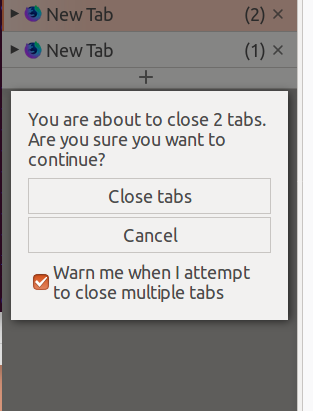

# webextensions-lib-rich-confirm

Helps to provide confirmation dialog with checkbox.

## Screenshots



## Required permissions

 * `tabs` or `activeTab`, if you want to use `RichConfirm.show()`.

## Basic usage

Load the file `RichConfirm.js` from any document (background page, sidebar panel, or browser action panel), like:

```json
<script type="application/javascript" src="./RichConfirm.js"></script>
```

And, call `RichConfirm.show()` with required parameters like:

```javascript
var result = await RichConfirm.show({
  message:      'Are you ready?',
  buttons:      ['Yes', 'No'],
  checkMessage: 'Never show',
  checked:      false
});
```

Here is the list of parameters:

 * `message` (required): A message for the confirmation dialog. (`String`)
 * `buttons` (required): Labels for buttons. (`Array` of `String`s)
 * `checkMessage` (optional): A label for the checkbox. (`String`)
 * `checked` (optional): Default state of the checkbox. (`Boolean`)

`RichConfirm.show()` returns a `Promise`. It will be resolved with an object with following attributes:

 * `buttonIndex`: The index of the button which is clicked. `-1` if the confirmation dialog is dismissed.
 * `checked`: The state of the checkbox.

## Confirmation in the content area

If you want to show the confirmation dialog in the content area, call `RichConfirm.showInTab()` with an ID of a tab, like:

```javascript
var result = await RichConfirm.showInTab(10, {
  message:      'Are you ready?',
  buttons:      ['Yes', 'No'],
  checkMessage: 'Never show',
  checked:      false
});
```

The first parameter is `tabs.Tab.id`, the second parameter is same to `RichConfirm.show()`.

